<div align="center">

```
  █████████  ██████████ ██████   █████ ███████████ █████ ██████   █████ ██████████ █████                  ███████████
 ███▒▒▒▒▒███▒▒███▒▒▒▒▒█▒▒██████ ▒▒███ ▒█▒▒▒███▒▒▒█▒▒███ ▒▒██████ ▒▒███ ▒▒███▒▒▒▒▒█▒▒███                  ▒▒███▒▒▒▒▒▒█
▒███    ▒▒▒  ▒███  █ ▒  ▒███▒███ ▒███ ▒   ▒███  ▒  ▒███  ▒███▒███ ▒███  ▒███  █ ▒  ▒███                   ▒███   █ ▒ 
▒▒█████████  ▒██████    ▒███▒▒███▒███     ▒███     ▒███  ▒███▒▒███▒███  ▒██████    ▒███        ██████████ ▒███████   
 ▒▒▒▒▒▒▒▒███ ▒███▒▒█    ▒███ ▒▒██████     ▒███     ▒███  ▒███ ▒▒██████  ▒███▒▒█    ▒███       ▒▒▒▒▒▒▒▒▒▒  ▒███▒▒▒█   
 ███    ▒███ ▒███ ▒   █ ▒███  ▒▒█████     ▒███     ▒███  ▒███  ▒▒█████  ▒███ ▒   █ ▒███      █            ▒███  ▒    
▒▒█████████  ██████████ █████  ▒▒█████    █████    █████ █████  ▒▒█████ ██████████ ███████████            █████      
 ▒▒▒▒▒▒▒▒▒  ▒▒▒▒▒▒▒▒▒▒ ▒▒▒▒▒    ▒▒▒▒▒    ▒▒▒▒▒    ▒▒▒▒▒ ▒▒▒▒▒    ▒▒▒▒▒ ▒▒▒▒▒▒▒▒▒▒ ▒▒▒▒▒▒▒▒▒▒▒            ▒▒▒▒▒

         ░▒▓  F I L E - F O R E N S I C   I N T E L L I G E N C E  ▓▒░

                     [ sandbox · detect · link · prove ]
```

### 🛰️ File-forensic intelligence suite · by **DGKN@Labs**

**Drop a file or a whole folder. SENTINEL-F takes every file apart inside a sandbox, tells you whether it was manipulated or is dangerous, links it to what you have seen before, and writes the forensic report.**

[](https://www.python.org/)
[](#-quick-start)
[](https://www.riverbankcomputing.com/software/pyqt/)
[](#-sandbox)
[](#-mitre-attck-heatmap)
[](#-tests)
[](#-custom-yara-rules)
[](NOTICE)
[](https://github.com/dogenc/SENTINEL-F/releases/latest)

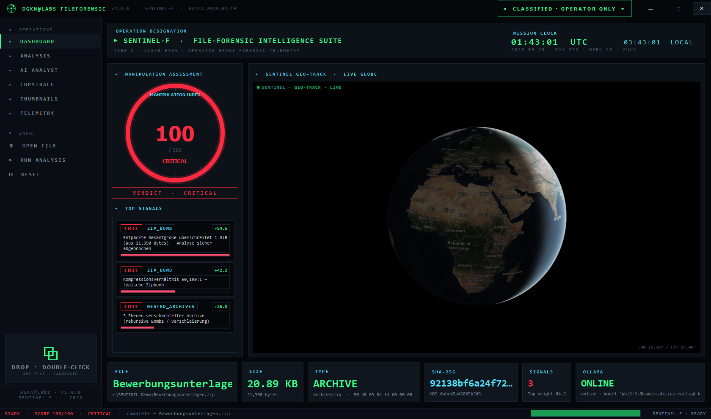

<sub>A 21 KB archive that would expand to over 1 GB is rated <b>CRITICAL 100/100</b>. It was measured inside the sandbox, never extracted.</sub>

</div>

---

## 📑 Contents

[How it works](#%EF%B8%8F-how-it-works) · [Gallery](#%EF%B8%8F-gallery) · [Highlights](#-highlights) · [Sandbox](#-sandbox) · [What it detects](#-what-it-detects) · [Investigation workflow](#-investigation-workflow) · [Download](#-download) · [Quick start](#-quick-start) · [Configuration](#-configuration) · [Shortcuts](#%EF%B8%8F-shortcuts) · [Architecture](#-architecture) · [Tests](#-tests) · [Kurzfassung (DE)](#-kurzfassung) · [License](#%EF%B8%8F-license)

---

## ⚙️ How it works

```
   ┌──────────────┐    path only    ┌───────────────────────────────────────────────┐
   │  GUI (PyQt6) │ ──────────────▶ │  SANDBOX WORKER  AppContainer · no network    │
   │  normal user │                 │                  Job Object · 1 proc · 2 GiB  │
   └──────▲───────┘                 │                                               │
          │                         │  ① true type    ~90 magic signatures          │
          │                         │  ② analyzers    PE · ELF · script · web · PDF │
          │                         │                 Office · image · mail · LNK … │
          │                         │  ③ payload chain  zip → js → base64 → exe …   │
          │                         │  ④ enrichment   ATT&CK · timeline · TLSH ·    │
          │                         │                 PRNU · C2PA · lineage · YARA  │
          │   result.json +         │  ⑤ score        0–100  CLEAN → CRITICAL       │
          │   re-encoded preview    └───────────────────────┬───────────────────────┘
          └─────────────────────────────────────────────────┘
          │ stored
          ▼
   ┌─────────────────────────────────────────────────────────────────────────────┐
   │  LOCAL HISTORY (SQLite)  hashes · IOCs · fingerprints · cases · intel cache │
   └───┬──────────┬───────────┬────────────┬────────────┬───────────┬────────────┘
       ▼          ▼           ▼            ▼            ▼           ▼
   similar     IOC graph   YARA from    detective    route /     signed report
   variants    campaigns   clusters     [E#] story   diff        Ed25519 + TSA
```

**In one sentence:** the GUI never touches the file. A locked-down worker takes it apart, every signal is scored and mapped to ATT&CK, and the local history links it to everything you have seen before, all the way to a signed, court-ready report.

| Step | What happens | You see it in |
|---|---|---|
| **1 · Drop** | A file, a folder, a mailbox, or a new download in a watched folder | Dashboard · Batch · Watch |
| **2 · Isolate** | A fresh sandbox worker per file, with no network and hard limits | `sandbox_violation` if it breaks out of bounds |
| **3 · Dissect** | True type, format analyzers, hidden stages extracted recursively | OVERVIEW · THREATS · CHAIN |
| **4 · Understand** | ATT&CK techniques, timestamp contradictions, photo & document provenance | ATT&CK · TIMELINE · LINEAGE |
| **5 · Link** | Known hashes, TLSH variants, shared IOCs, same camera, same document family | SIMILAR · IOC graph · History |
| **6 · Prove** | Cited incident narrative and a signed HTML/PDF report | Detective · 📄 REPORT |

---

## 🖼️ Gallery

<table>
<tr>
<td width="33%"><br><sub>💣 Zip bomb → CRITICAL</sub></td>
<td width="33%">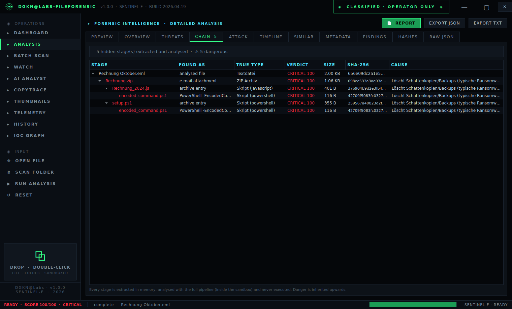<br><sub>🔓 Payload chain</sub></td>
<td width="33%">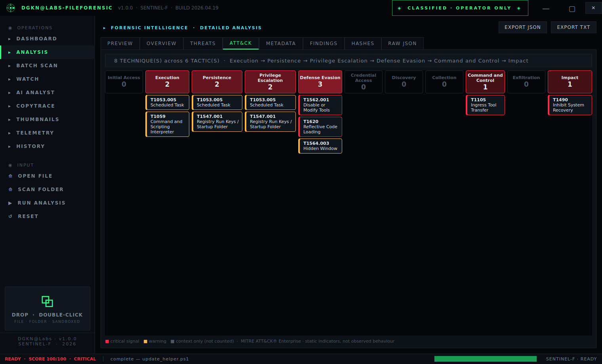<br><sub>🎯 ATT&CK heatmap</sub></td>
</tr>
<tr>
<td>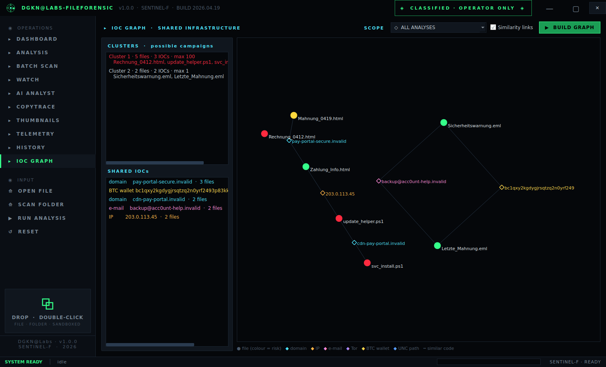<br><sub>🕸 IOC graph · campaigns</sub></td>
<td>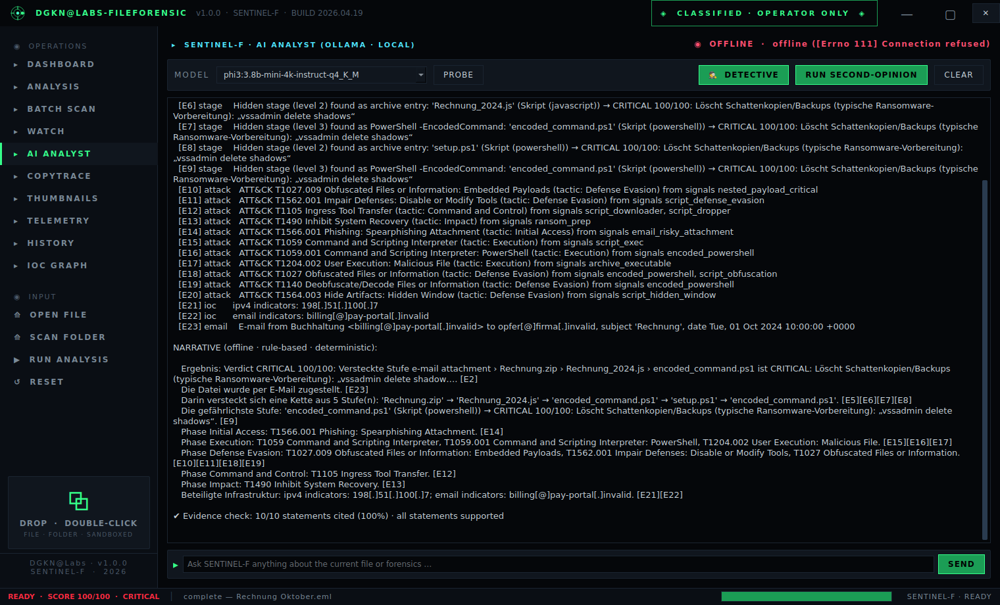<br><sub>🕵 Detective mode</sub></td>
<td>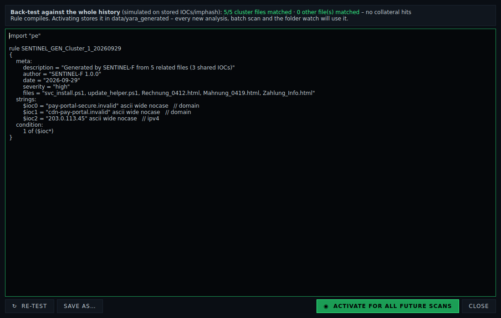<br><sub>🧬 YARA from a cluster</sub></td>
</tr>
<tr>
<td>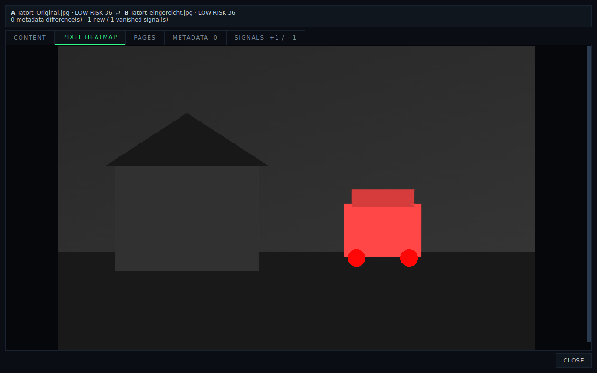<br><sub>⇄ Before/after diff</sub></td>
<td>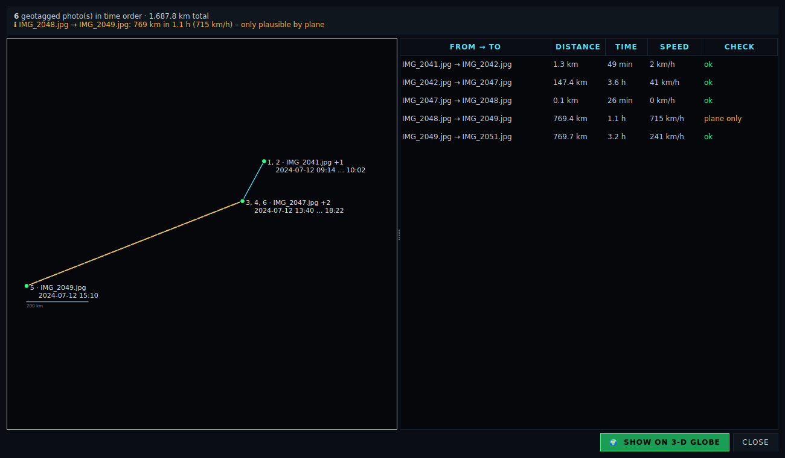<br><sub>🗺 Movement profile</sub></td>
<td>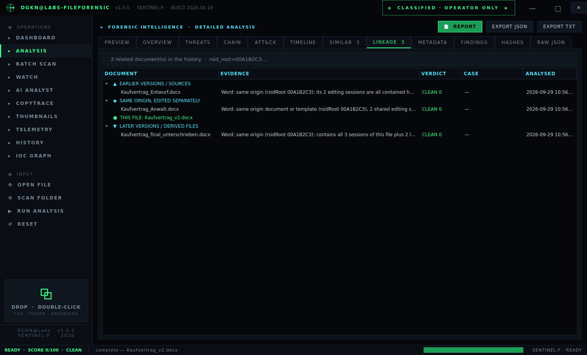<br><sub>🌳 Document lineage</sub></td>
</tr>
<tr>
<td>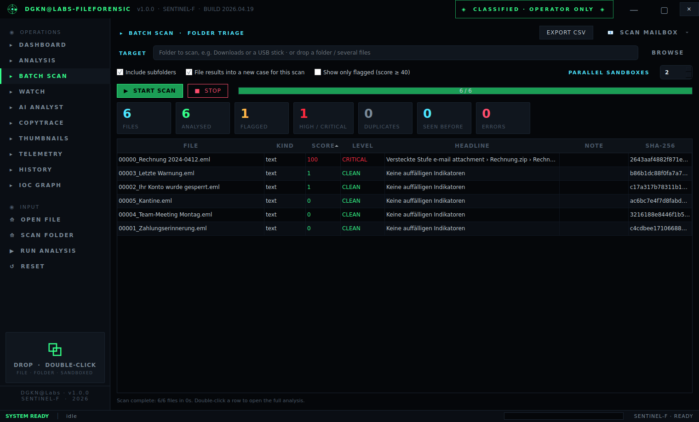<br><sub>📧 Mailbox scan</sub></td>
<td>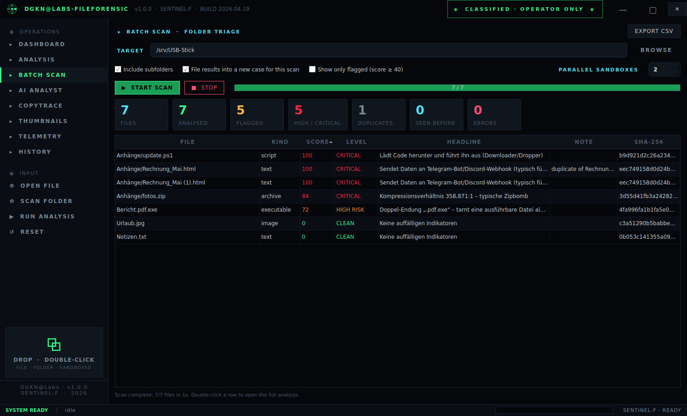<br><sub>📂 Batch scan</sub></td>
<td>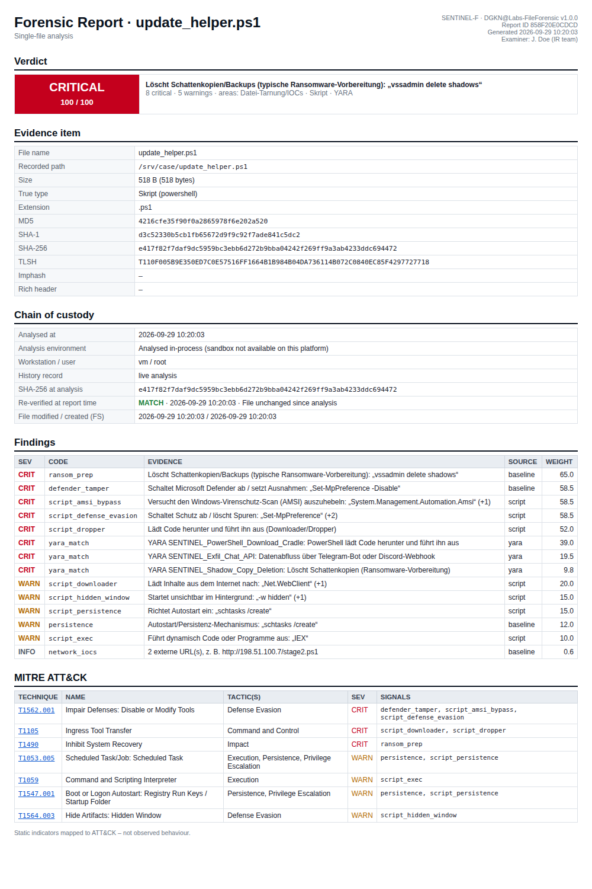<br><sub>📄 Signed report</sub></td>
</tr>
</table>

<sub>Every screenshot is the real app, captured by <code>scripts/capture_screenshots.py</code> on harmless demo files. Details for each feature follow below.</sub>

---

## ✨ Highlights

| | |
|---|---|
| 🛡 **Sandboxed by design** | Every file is parsed in a separate process: an AppContainer with no network, inside a Windows Job Object. It can't start programs, can't write to your files or registry, has no internet access, and is capped at 2 GiB RAM. |
| 💣 **Bombs caught unopened** | Zip, image and XML bombs are measured, never extracted. A 21 KB archive expanding at 50 000 : 1 is flagged **CRITICAL**. |
| 🎭 **Disguises exposed** | The true type comes from the content (about 90 signatures). It catches an EXE renamed to `.pdf`, `Rechnung.pdf.exe`, RTLO tricks and payloads hidden in images. |
| 🦠 **Static malware triage** | PE capabilities, packers, script droppers, AMSI bypasses, webshells, HTML smuggling, phishing kits, LNK/RTF exploits, e-mail spoofing and YARA. |
| 🔓 **Payload chain** | Hidden stages are extracted and analysed recursively (archives, attachments, macros, encoded commands, Base64 smuggling, embedded programs). Danger is inherited upwards. |
| 🧬 **Own threat intel** | One click turns a campaign cluster into a back-tested YARA rule that guards every future scan. IOCs export as STIX 2.1, MISP or CSV. |
| 📸 **Photo authenticity** | Content Credentials (C2PA), hard traces of AI generators, and a camera-sensor fingerprint (PRNU) that links photos taken with the same camera. |
| 🌳 **Document lineage** | Shows which file is an earlier version, a branch or a later edit of which, using PDF `/ID`, XMP `DerivedFrom`/`History` and Word RSIDs. |
| 🗺 **Movement profile** | Lays out the geotagged photos of a case as a timed route and flags physically impossible legs, both on a 2-D map and on the 3-D globe. |
| ⇄ **Before/after diff** | Compares two versions in the sandbox: changed text lines, which PDF pages changed, a pixel heatmap of retouched regions, and metadata and signal changes. |
| ☁ **Hash lookup (opt-in)** | Checks the hash with CIRCL hashlookup (known-good files), VirusTotal and MalwareBazaar. Only the SHA-256 is sent, never the file. |
| 🎯 **MITRE ATT&CK®** | Every signal is mapped to a technique and shown as a kill-chain heatmap. |
| ⏱ **Timestamp timeline** | Exposes backdated documents and forged e-mails. |
| 🧬 **Variant detection** | A pure-Python TLSH (byte-identical to the reference library), imphash and Rich header find modified versions of known malware. |
| 🕸 **IOC graph** | Shows which files share domains, IPs, wallets or code, and groups them into campaigns. |
| 📧 **Mailbox scan** | Outlook PST/OST/MSG, Thunderbird/mbox and EML folders: every mail and attachment is analysed in the sandbox and filed into its own case. |
| 📂 **Batch & 👁 watch** | Scan whole folders in parallel, or guard Downloads live with tray alerts. |
| 🗂 **History & cases** | Everything is stored locally and searchable by hash or IOC. Known files are recognised instantly. |
| 📄 **Forensic reports** | HTML/PDF per file or per case, with chain of custody and defanged IOCs, **signed with Ed25519**. An RFC 3161 time-stamp is optional. |
| 🕵 **Detective mode** | An incident narrative in which every statement cites a numbered piece of evidence. It works offline, and any model output is checked sentence by sentence. |
| 🤖 **Local AI** | An optional Ollama second opinion, hardened against prompt injection. |

---

## 🛡 Sandbox

Windows 11 Home has no *Windows Sandbox*. SENTINEL-F builds its own isolation from built-in Windows primitives, so no admin rights are needed:

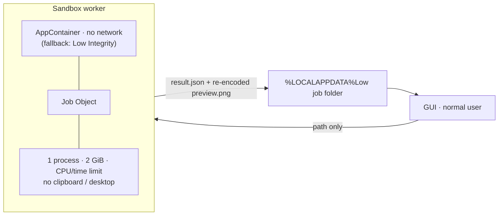
```mermaid
flowchart LR
    A[GUI · normal user] -- "path only" --> B
    subgraph B[Sandbox worker]
        direction TB
        B1["AppContainer · no network<br/>(fallback: Low Integrity)"] --- B2[Job Object]
        B2 --- B3["1 process · 2 GiB · CPU/time limit<br/>no clipboard / desktop"]
    end
    B -- "result.json + re-encoded preview.png" --> C[%LOCALAPPDATA%Low job folder]
    C --> A
```

| Layer | What it prevents |
|---|---|
| **Separate process** | A crash or parser exploit never hits the app |
| **AppContainer, no capabilities** | **No network at all** (no internet, no loopback) and no access to your files: the evidence is copied into the job folder first, and its own permissions are never touched. No admin rights needed. If setup fails, the worker falls back to Low IL, and the result records the reason |
| **Low Integrity Level** | No writes to user files, programs or the registry, just like a browser sandbox |
| **Job Object: 1 active process** | The worker can't launch anything, so no `cmd`, no dropped payloads |
| **Job Object: RAM + CPU limits, kill-on-close** | Bombs are stopped hard and the PC stays responsive |
| **UI restrictions** | No clipboard, desktop or system-setting access |
| **Sandbox-rendered preview** | The GUI only shows a PNG the sandbox re-encoded, never the original |

If a file crashes the worker or blows through a limit, that becomes a **finding** in its own right (`sandbox_violation`). The test suite **proves** each barrier with probe processes: starting `cmd.exe`, writing to the profile, creating an HKCU key, allocating 4 GiB, **opening a TCP connection** and **reading your Documents** are all blocked, and a hang is killed at the timeout. The Windows probes live in `tests/test_sandbox.py`; run them once on your machine with `python -m pytest tests/test_sandbox.py -v`.

The AppContainer only gets read access to the code (Python, `core/`, `engines/`, `resources/`), never to `data/` (history), `reports/` or `config/local_secrets.py`. Switch it off with `SANDBOX_BLOCK_NETWORK = False` in `config/settings.py`.

> **Scope:** This is static analysis in a hardened process. It is not a full VM. Nothing is ever executed, archives are only counted, never extracted, and the worker has no network access. For live detonation of real malware, use a dedicated VM.

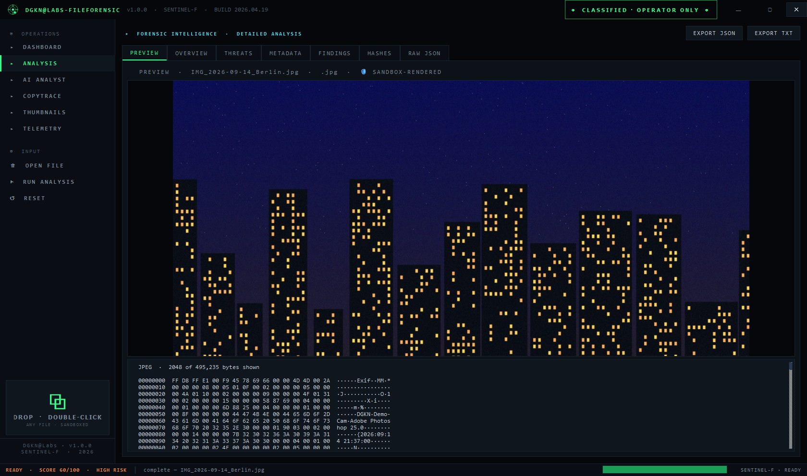
<sub><b>Preview re-encoded inside the sandbox</b> + hex view. The GUI never decodes the original file.</sub>

---

## 🔍 What it detects

| Domain | Coverage |
|---|---|
| **All files** | MD5 / SHA-1 / SHA-256 / TLSH · true type vs. extension · entropy profile · strings and IOCs (URL, IP, domain, e-mail, registry, Base64, crypto wallets, Tor) · double extension and RTLO · embedded and appended payloads · polyglots · Mark-of-the-Web origin · suspicious commands (LOLBins, shadow-copy deletion, Defender tampering) |
| **Archives** | ZIP / JAR / APK / OOXML, TAR, GZ / BZ2 / XZ / ZSTD, 7z, CAB, ISO · **zip bombs** · zip-slip · symlinks · lying headers · encrypted payloads · executables in archives and disk images |
| **Images** | EXIF / XMP / IPTC, consistency checks, ELA, channel, histogram and noise analysis, LSB stego, **JPEG ghosts** (a pasted region that carries a second compression quality, located as x/y/w/h), **copy-move** (one dominant duplicated region; repeating textures like tiles are ignored), **image bombs** (header-only) |
| **PDFs** | Version, pages, encryption, JavaScript, metadata, redaction recovery, black-rectangle redactions, embedded images and links, unused objects |
| **Office** | DOCX / XLSX / PPTX / DOC / XLS / PPT: structure, metadata, hidden content, VBA macros and suspicious keywords, embedded objects, revisions, external relationships |
| **Programs** | PE: API capability groups, packers (UPX, Themida, VMProtect …), W+X sections, entry-point anomalies, TLS callbacks, overlay, signature and data appended after it, fake vendor, imphash, Rich header, reproducible-build aware · ELF basics |
| **Scripts** | PowerShell, VBS, JS, BAT, HTA, WSF, Python, Shell, PHP: downloaders, obfuscation, hidden windows, AMSI bypass, persistence, credential theft, reflective loading, webshells · `-EncodedCommand` is decoded for display only |
| **Web** | HTML smuggling, phishing forms, Telegram / Discord exfiltration, hidden iframes, redirects, SVG scripts, HTA |
| **More** | LNK (hidden commands, icon masquerade, padding) · RTF (Equation Editor exploit, auto-update OLE) · E-mail (display-name spoofing, SPF / DKIM / DMARC, dangerous attachments, masked links) · SQLite (deleted-data freelist, browser DBs, opened immutable read-only) · **YARA** |

Every signal feeds a **0–100 score** (`CLEAN` → `CRITICAL`). The scoring was calibrated against about 270 benign system files, and the last sample of 98 had **0 false positives at ELEVATED or above**.

<table><tr>
<td width="50%">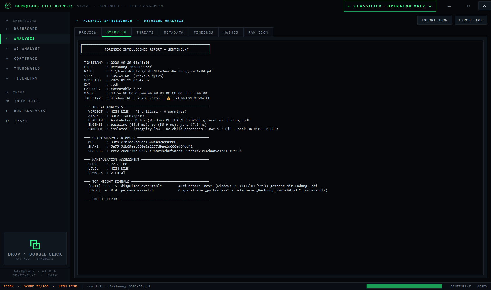<br><sub><b>An EXE disguised as <code>Rechnung.pdf</code></b>, exposed by its content</sub></td>
<td width="50%">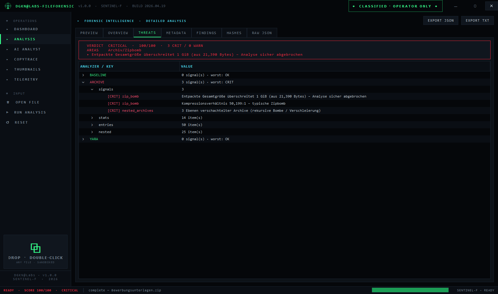<br><sub><b>Threats tab</b>: per-analyzer evidence tree</sub></td>
</tr></table>

---

## 🕵️ Investigation workflow

### 🔓 Payload chain: the whole attack, layer by layer

Real attacks are nested, for example `.eml → .zip → .js → powershell -EncodedCommand → downloader`. SENTINEL-F extracts every **next stage** and runs the complete analysis on it again, up to 3 levels deep, with hard limits on count, size and time:
- archive entries (ZIP/TAR/GZ/BZ2/XZ)
- e-mail and PDF attachments
- VBA macros
- `-EncodedCommand` / `FromBase64String`
- Base64 blobs carrying a file signature (HTML smuggling)
- carved embedded programs
- data appended after the end of file
- LNK command lines

A container is never rated lower than its most dangerous stage. The headline names the path to the root cause, and ATT&CK techniques and IOCs of inner stages flow up into the verdict, the history search and the IOC graph. Nothing is executed. A stage exists on disk only for the moment it is analysed, inside the sandbox's private folder.


<sub>An invoice e-mail → ZIP → JavaScript → Base64-encoded PowerShell that deletes shadow copies. Every stage is CRITICAL, and the root cause is shown on each line.</sub>

### 🎯 MITRE ATT&CK heatmap

About 90 signal types are mapped to ATT&CK techniques, but only where the mapping is unambiguous. The **ATT&CK** tab shows them as a kill-chain matrix from Initial Access to Impact. The colour shows the strongest signal, and each technique links to its MITRE page.


<sub>A PowerShell dropper spans 6 tactics: AMSI bypass, Defender tampering, download cradle, scheduled task and shadow-copy deletion.</sub>

### ⏱ Timeline: backdated documents

All timestamps of a file go on one axis: file system, EXIF/XMP, PDF info, Office core properties, PE compile time and e-mail `Date` / `Received` hops. Contradiction rules flag the following:
- *created after it was last modified*
- *embedded date later than the file on disk*
- *dates in the future*
- *backdated e-mails*
- *photos edited later*

Values without a time zone get a 14 h tolerance, and there were 0 false alarms on 60 real files. The timeline informs; it deliberately does not change the calibrated score.

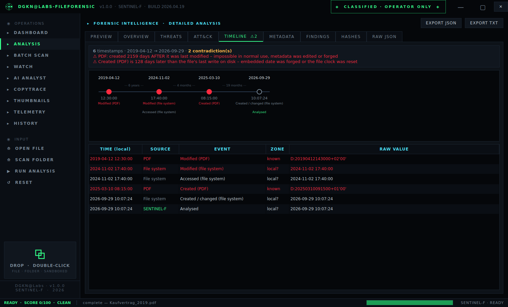
<sub>A contract that claims to be from 2019 was in fact created in 2025, four months after the file was last written to disk.</sub>

### 🧬 Similar files: variants, not just duplicates

Every file gets a **TLSH** fuzzy hash. Programs also get an **imphash** (import table) and a **Rich-header hash** (build toolchain). The **SIMILAR** tab lists earlier files that are related but not identical, and double-clicking one opens it.

The TLSH implementation is pure Python/numpy and **byte-identical to the reference library** (verified against py-tlsh), so no C++ compiler is needed on Windows, and hashes compare directly with VirusTotal and MalwareBazaar.

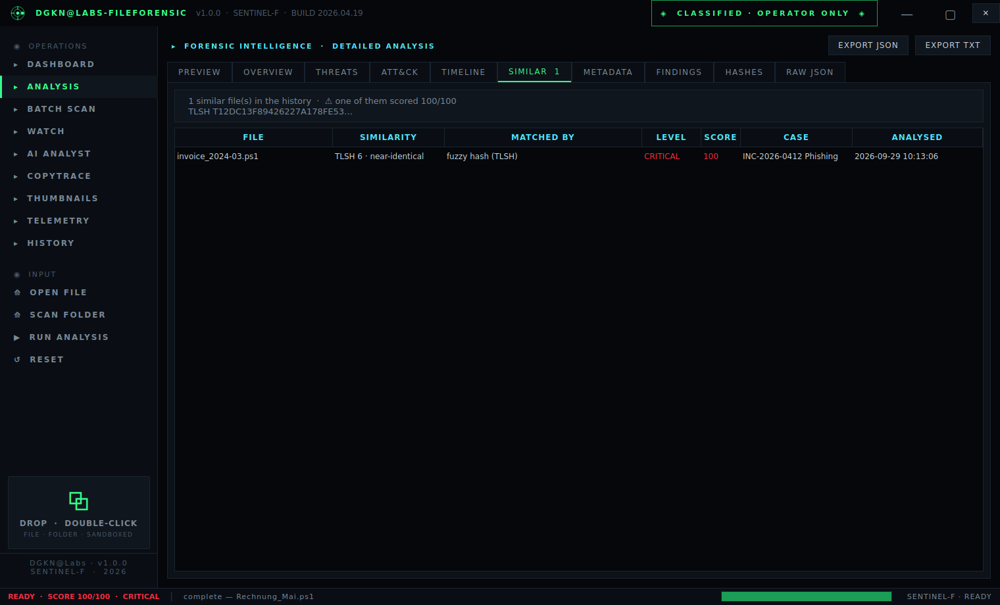
<sub>A renamed, slightly modified dropper is matched to the original from an earlier incident (TLSH distance 6).</sub>

### 📂 Batch scan: whole folders

Drop a folder (Downloads, a USB stick, a mailbox export) or several files, or press `Ctrl+Shift+O`. Every file runs in **its own sandbox**, several in parallel. The result list is **sorted by risk**, with duplicates, already-known files and variants marked. It is filed into a new case and can be exported as CSV (hardened against formula injection).


### 📧 Mailbox scan: a whole inbox in one go

**📧 SCAN MAILBOX** in the batch view accepts the following:
- an Outlook **PST/OST** (via `libpff-python`, prebuilt for Windows)
- a single **.msg** (via `extract-msg`)
- a **Thunderbird profile**, where every mbox file is detected automatically
- any **mbox** (Gmail Takeout, Apple Mail export)
- a folder of **.eml** files

The mailbox is split into single messages **inside the sandbox**. Every message then runs through the normal analysis, and the payload chain unpacks the attachments. The results are filed into a case *Mailbox · …* and sorted by risk. The IOC graph then shows which mails belong to one campaign. The extracted messages are kept in `data/mailboxes/`.


### 👁 Live folder guard

Watch Downloads or any folder. A new file is checked the moment its download completes. Unfinished `.crdownload` / `.part` files are ignored. A **tray notification** fires from the risk level you choose, and clicking it opens the analysis. Closing the window keeps the guard running in the tray, and it resumes on the next start.

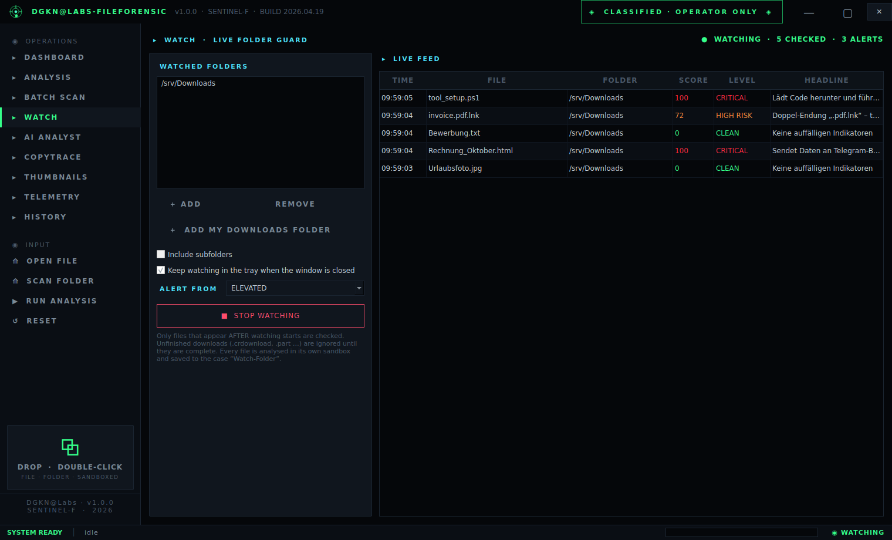

### 🗂 History, cases & IOC search

Every analysis is stored in a local SQLite database (`data/`, never committed):
- Files seen before are recognised by SHA-256, even under a new name.
- Analyses are filed into **cases**.
- One search box finds files by name, hash prefix or **any URL, IP, domain or e-mail they contained**.
- Stored results reopen instantly without touching the file again.

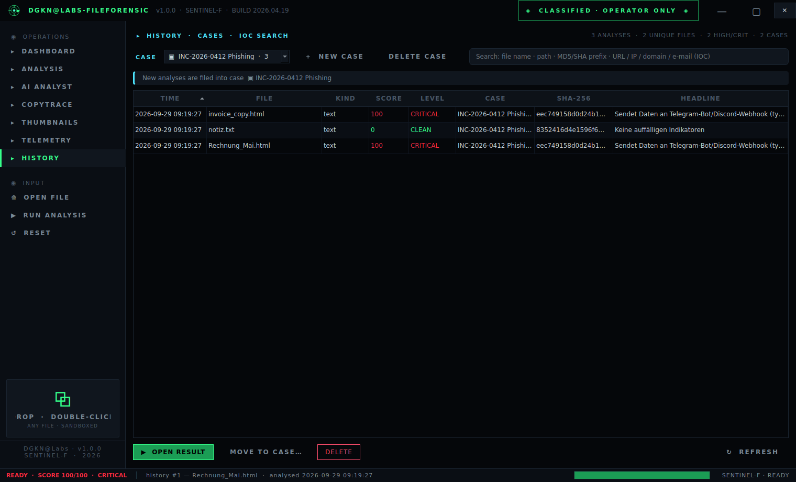

### 🕸 IOC graph: campaigns

The graph shows files and the infrastructure they **share** (domains, IPs, e-mail addresses, BTC/XMR wallets, Tor, UNC paths). Dashed lines mark similar code. IOCs seen in only one file and benign vendor domains are left out. Connected groups become **clusters**, which are candidate campaigns. Clicking a cluster highlights it, and double-clicking a file opens it.


<sub>A mailbox export resolves into two campaigns: a phishing kit with its loaders, and a sextortion wave sharing one wallet.</sub>

### 🕵 Detective mode: the story, with evidence

**🕵 DETECTIVE** in the AI analyst turns the findings into a **numbered evidence list** `[E1]…[En]`:
- verdict, signals and hidden stages
- ATT&CK techniques and timestamp contradictions
- defanged IOCs and the e-mail header
- similar files and earlier sightings

From that list it tells **what happened**, along the kill chain: delivery → hidden stages → execution → evasion → C2 → impact. Every sentence cites its evidence.
- **Offline**: a deterministic, rule-based narrator writes the story, so no model is needed.
- **With the local model (Ollama)**: the model only sees the evidence list, as JSON data. Its answer, and every follow-up question in the chat, is **verified sentence by sentence**. Statements without valid evidence are marked **⚠**, and the coverage is shown, so hallucinations cannot slip into a report.

The forensic report includes the narrative together with its evidence table.


### 📸 Photo authenticity: real camera or AI?

- **Content Credentials (C2PA)**: detects the manifest (JPEG APP11/JUMBF, PNG `caBX`), the claim generator, the edit actions and a declared AI origin (`digitalSourceType = trainedAlgorithmicMedia`). Without `c2pa-python` the manifest is reported as *not cryptographically verified*.
- **AI generator traces**: only hard evidence counts, never pixel guessing:
  - IPTC DigitalSourceType
  - Stable Diffusion / A1111 parameters, ComfyUI graphs and InvokeAI prompts in PNG text chunks
  - Firefly, Midjourney, DALL·E, NovelAI and others in Software/XMP

  There were 0 hits on 30 real photos.
- **Camera fingerprint (PRNU)**: the sensor's noise pattern from a full-resolution center crop is stored with every photo. **SIMILAR** then shows other photos from the same camera. The threshold is statistical (≥ 6 σ above chance). In tests it produced **0 false matches** across 108 cross-camera pairs and found every same-camera pair at normal sensor strength. It is an indicator, not proof: it needs original, unscaled photos of the same resolution, and a missing match proves nothing.

### 🌳 Document lineage: who copied from whom?

Office and Adobe tools leave provenance IDs that survive renaming. The **LINEAGE** tab uses them to sort every related document in the history into three groups:
- **▲ earlier versions / sources**
- **◆ same origin, edited separately** (a branch)
- **▼ later versions / derived files**

| Evidence | Meaning |
|---|---|
| PDF trailer `/ID` | The first ID is permanent across versions, and the number of incremental save states gives the order |
| XMP `DerivedFrom`, `History`, `OriginalDocumentID` | Explicit parent → child links (Photoshop, Acrobat, Office, many cameras) |
| Word `rsidRoot` + RSIDs | The origin document. A file containing all editing sessions of another, plus more, is its later version |

The lineage is guarded against templates. Identical session lists (two untouched documents from one template) and IDs shared by many files count as *generator*, not *origin*.


### 🗺 Movement profile: does the alibi hold?

**🗺 ROUTE** in the history orders every geotagged photo of the selected case by its capture time. It computes each leg: great-circle distance, time and speed.

A leg faster than an airliner, or two places in the same second, is marked **IMPOSSIBLE**, which means the GPS or the timestamp was altered. Legs that are only plausible by plane are marked too. Photos without a capture time are listed separately.

The 2-D map needs no key and no internet. **Show on 3-D globe** draws the same route on the Cesium earth, with impossible legs in red.


<sub>An alibi check: one photo claims Paris just over an hour after Leipzig. That is only possible by plane, and the next photo is back in Leipzig.</sub>

### ⇄ Before/after diff: what exactly was changed?

Select two analyses in the history and click **⇄ COMPARE**. The older one is *A*, the newer one is *B*. The contents are compared **inside the sandbox** (worker mode `--sentinel-diff`):

| File type | What you get |
|---|---|
| Text, scripts, web, e-mail, Office | A unified line diff (added/removed), plus a similarity % |
| PDF | Which **pages** changed, were added or removed (hash per page content), plus a text diff |
| Images | Percentage of changed pixels, **regions** (x, y, w, h), and a heatmap re-encoded by the sandbox |
| Anything else | Changed byte ranges |

Metadata differences and new or vanished signals come straight from the stored findings. That part works even if the files are gone. If a file changed since its analysis, the dialog says so.


<sub>A submitted "crime-scene photo" compared with the original: exactly one region was retouched, where the car was removed.</sub>

### ☁ Hash lookup: what does the world know? (opt-in)

The **INTEL** tab sends **only the SHA-256** (never the file) to:
- **CIRCL hashlookup**: no key needed, knows millions of *known-good* files (NSRL)
- **VirusTotal**: shows engine detections and the threat label
- **MalwareBazaar**: shows the known sample, its family and tags

The lookup is **off by default**. Turn it on with `DGKN_HASH_LOOKUP=1`, or set `HASH_LOOKUP_ENABLED = True`. VirusTotal and MalwareBazaar need your own keys in `config/local_secrets.py`.

Results are cached in the history for 7 days, which respects rate limits, and are stored with the analysis. They also appear in the detective evidence and in the report.

### 🧬 Own threat intel: learn from every case

Select a cluster in the IOC graph and click **🧬 YARA RULE**. SENTINEL-F writes a rule from the IOCs the files **share**, plus a shared imphash. It builds the rule only from the stored findings and never reopens the originals.

A **back-test against the whole history** shows how many cluster files the rule catches and whether it hits anything else. The `N of ($ioc*)` threshold is tuned automatically for full coverage with zero collateral hits. **Activate** stores the rule in `data/yara_generated/`, and from then on every analysis, batch scan and the folder watch uses it, so the next variant is caught on download.

**⇪ EXPORT IOCs** writes the selected cluster, or the whole case, as a **STIX 2.1** bundle (stable IDs, ATT&CK attack-patterns), a **MISP** event (TLP tag, galaxy tags) or **CSV**.


### 📄 Forensic reports: HTML & PDF

**📄 REPORT** in the analysis view (`Ctrl+P`) or **📄 CASE REPORT** in the history writes a self-contained report. It includes:
- verdict, evidence item with all hashes, findings, ATT&CK, timeline, IOCs and similar files
- **chain of custody**: the SHA-256 is re-verified when the report is written, so a changed file shows up as `MISMATCH`

The report has no JavaScript and no external resources. Indicators are **defanged** (`hxxps://evil[.]com`), and every value taken from the file is escaped. Case reports add cross-file ATT&CK coverage and shared infrastructure.

**Court-proof signing.** Every report is signed with the workstation's **Ed25519** key and gets a `<report>.sig` file. On Windows, the private key is bound to your account with DPAPI. **✔ VERIFY REPORT** in the history detects any later change to the report or the signature. It also tells you whether the signature is from your own key or a foreign one, so you can compare fingerprints with the sender.

Optionally, set `REPORT_TSA_URL` (or env `DGKN_TSA_URL`, e.g. `https://freetsa.org/tsr`) to get an **RFC 3161 time-stamp** (`.tsr`) that proves the report existed at that moment. Only the report's SHA-256 is sent. For full chain verification, use `openssl ts -verify -data report.html -in report.html.tsr -CAfile tsa.pem`.


---

## 💾 Download

Ready-to-run Windows builds are on the **[Releases page](https://github.com/dogenc/SENTINEL-F/releases/latest)**. No Python install is needed.

| Edition | File | For whom |
|---|---|---|
| 🧩 **Setup** | `SENTINEL-F-<version>-Setup-win64.exe` | Normal use. Adds a Start-menu entry, an optional desktop icon and **Analyze with SENTINEL-F** in the Explorer right-click menu for files and folders, plus a clean uninstaller. Installs without admin rights for your user, or for all users with admin rights. |
| 🎒 **Portable** | `SENTINEL-F-<version>-Portable-win64.zip` | USB stick or a borrowed PC. Unzip and start `DGKN-FileForensic.exe`. Everything stays inside the folder, nothing goes into AppData or the registry. |

**Where your data lives**

| Mode | History, cases, settings, signing key | Reports |
|---|---|---|
| Setup | `%LOCALAPPDATA%\DGKN-FileForensic\data\` | `%LOCALAPPDATA%\DGKN-FileForensic\reports\` |
| Portable | `UserData\data\` next to the EXE | `UserData\reports\` |
| From source | `data/` in the project folder | `reports/` |

The portable mode is switched on by the file `portable.txt` next to the EXE. `DGKN_USER_DIR` overrides the location in every mode. Uninstalling keeps your data. In every mode the sandbox's short-lived job folders live in `%LOCALAPPDATA%Low\DGKN_Sentinel\jobs`, the only place a low-integrity process may write.

`SHA256SUMS.txt` on the release page lets you check your download: `Get-FileHash .\SENTINEL-F-*-Setup-win64.exe`.

> Windows SmartScreen may warn on first start because the builds are not code-signed. Click *More info → Run anyway*, or build it yourself (see below).

## 🚀 Quick start

```bash
git clone https://github.com/dogenc/SENTINEL-F.git
cd SENTINEL-F
pip install -r requirements.txt
python main.py
```

Optional extras:

| Extra | Unlocks |
|---|---|
| [Ollama](https://ollama.com/download) + `ollama pull phi3:3.8b-mini-4k-instruct-q4_K_M` | AI second opinion |
| [Tesseract OCR](https://github.com/UB-Mannheim/tesseract/wiki) + [Poppler](https://github.com/oschwartz10612/poppler-windows/releases) | OCR-based PDF redaction recovery |

## 🔑 Configuration

Everything works without keys, except the imagery of the 3-D globe. **Secrets are never committed and never bundled into the EXE.**

| What | Where | Needed for |
|---|---|---|
| `CESIUM_ION_TOKEN` | `config/local_secrets.py` or env `DGKN_CESIUM_ION_TOKEN` | 3-D globe ([free token](https://ion.cesium.com/tokens)) |
| `MAPTILER_KEY` | `config/local_secrets.py` or env `DGKN_MAPTILER_KEY` | satellite/hybrid tiles on the globe ([free key](https://cloud.maptiler.com/account/keys/)) |
| `DGKN_YARA_DIR` *(optional)* | env | extra YARA rule folder |
| `OLLAMA_HOST` / `OLLAMA_MODEL` *(optional)* | `config/settings.py` | local AI |
| `DGKN_HASH_LOOKUP=1` *(optional)* | env, or `HASH_LOOKUP_ENABLED` in `config/settings.py` | hash lookup at all (off by default) |
| `VT_API_KEY` *(optional)* | `config/local_secrets.py` or env `DGKN_VT_API_KEY` | VirusTotal lookups ([free key](https://www.virustotal.com/gui/my-apikey)) |
| `MB_AUTH_KEY` *(optional)* | `config/local_secrets.py` or env `DGKN_MB_AUTH_KEY` | MalwareBazaar lookups ([abuse.ch key](https://auth.abuse.ch/)) |
| `DGKN_TSA_URL` *(optional)* | env, or `REPORT_TSA_URL` in `config/settings.py` | RFC 3161 time-stamps for reports |

```bash
copy config\local_secrets.example.py config\local_secrets.py   # then fill in the two keys
```

**Setup / Portable:** put the same file as `local_secrets.py` into your user-data folder (`%LOCALAPPDATA%\DGKN-FileForensic\` or `UserData\`), or set the environment variables. The template is [`config/local_secrets.example.py`](config/local_secrets.example.py).

Local runtime data (all git-ignored): `data/` holds the history DB, watch and report settings, **your signing key** (`data/signing/`, copy it to keep your identity on a new PC), `reports/` holds exported reports, and `.cache/` holds the rendered globe.

## 🧬 Custom YARA rules

Drop `.yar` files into [`resources/yara/`](resources/yara/), or point `DGKN_YARA_DIR` at a folder, for example a [YARA-Forge](https://github.com/YARAHQ/yara-forge) pack. Each file compiles separately, so one broken rule never disables the rest. Use `meta: severity = "critical" | "high" | "medium" | "low"` to set a rule's weight.

## 📦 Build Setup & Portable yourself

On Windows with Python 3.12 (64-bit) and, for the installer, [Inno Setup 6](https://jrsoftware.org/isdl.php) (`winget install JRSoftware.InnoSetup`):

```powershell
powershell -ExecutionPolicy Bypass -File scripts\build_windows.ps1
# → dist\SENTINEL-F-<version>-Setup-win64.exe
# → dist\SENTINEL-F-<version>-Portable-win64.zip
# → dist\SHA256SUMS.txt
```

The script installs the requirements, builds the EXE with PyInstaller ([`DGKN_FileForensic.spec`](DGKN_FileForensic.spec)), runs a smoke test through the EXE's own sandbox worker, then packs the portable ZIP and the installer ([`installer/sentinel-f.iss`](installer/sentinel-f.iss)). `-PortableOnly` skips the installer. The EXE starts its own sandbox workers (`--sentinel-worker`), so no Python install is needed on the target PC.

**Automatic releases:** pushing a version tag builds both editions on a GitHub Windows runner, after the full test suite, and attaches them to a GitHub release ([`.github/workflows/windows-release.yml`](.github/workflows/windows-release.yml)):

```bash
git tag v1.0.1 && git push origin v1.0.1
```

Or without a local tag: **Actions → Windows build → Run workflow → ☑ release**. The tag `v<APP_VERSION>` from `config/settings.py` is created for you, so raise `APP_VERSION` first.

---

## ⌨️ Shortcuts

| Keys | Action |
|---|---|
| `Ctrl+O` | Open file |
| `Ctrl+Shift+O` | Scan a folder (batch) |
| `Ctrl+R` / `F5` | Run analysis |
| `Ctrl+P` | Forensic report (HTML/PDF) |
| `Ctrl+E` | Export raw JSON |
| `1` `2` `3` | Dashboard · Analysis · AI analyst |
| `4` `5` `6` | Telemetry · CopyTrace · Thumbnails |
| `7` `8` `9` `0` | History · Batch scan · Folder watch · IOC graph |

---

## 🏗 Architecture

```
DGKN_FileForensic/
├── main.py                    entry point (+ sandbox worker mode)
├── config/
│   ├── settings.py            theme, score weights, paths, SANDBOX_ENABLED
│   └── local_secrets.example.py   template for your keys (copy → local_secrets.py)
├── core/
│   ├── sandbox.py             sandbox worker: AppContainer / Low IL + Job Object (ctypes, no admin)
│   ├── appcontainer.py        no-network AppContainer for the worker (least-privilege grants)
│   ├── filetype.py            ~90 magic signatures, true type vs. extension
│   ├── history.py             SQLite: analyses, cases, IOC + fingerprint index
│   ├── batch.py               folder collection + parallel sandbox runner
│   ├── watcher.py             polling folder guard (stable-size check)
│   ├── geo.py                 GPS movement profile, impossible-leg detection
│   ├── lineage.py             document family tree (ancestor / branch / descendant)
│   ├── intel.py               cluster → YARA rule (back-tested), STIX 2.1 / MISP / CSV export
│   ├── iocgraph.py            shared-IOC graph, clusters, force layout (numpy)
│   ├── report.py              HTML/PDF reports, chain of custody, defanging
│   ├── threatintel.py         opt-in hash lookup (CIRCL / VirusTotal / MalwareBazaar), cached
│   ├── signing.py             Ed25519 report signatures (DPAPI key) + RFC 3161 time-stamps
│   └── utils.py               hashing, legacy routing, logger
├── engines/
│   ├── __init__.py            run_forensic(): engines + analyzers + scoring + enrichment
│   ├── sandbox_worker.py      the only place file content is parsed
│   ├── analyzers/             one module per format (baseline, archive, pe, elf, script,
│   │                          web, lnk, rtf, mail, sqlite, photo, lineage, yara_scan, limits)
│   ├── image_engine.py · pdf_engine.py · document_engine.py
│   ├── score_engine.py        0–100 heuristic score
│   ├── payloads.py            payload chain: extract hidden stages, recursive analysis
│   ├── attack.py              signal → MITRE ATT&CK technique mapping
│   ├── timeline.py            all timestamps on one axis + contradiction rules
│   ├── similarity.py          pure-Python TLSH (reference-identical), imphash/Rich
│   ├── mailbox_split.py       PST/OST/MSG/mbox/Thunderbird → single .eml (runs in the sandbox)
│   ├── diff.py                content diff (text / PDF pages / pixels / bytes) + findings diff
│   ├── detective.py           evidence list, cited narrative, sentence-level verification
│   └── ollama_client.py       local AI (prompt-injection hardened)
├── gui/                       PyQt6 views: dashboard, analysis (14 tabs: PREVIEW … CHAIN,
│                              ATT&CK, TIMELINE, SIMILAR, LINEAGE, INTEL, META … JSON),
│                              batch, watch, history, IOC graph, route, diff, reports
├── resources/                 cesium_globe.html · yara/
├── installer/                 Inno Setup script (Setup.exe) + portable.txt marker
├── scripts/                   build_windows.ps1 (Setup + Portable), capture_screenshots.py, make_icon.py
└── tests/                     199 tests
```

Adding a format means adding one analyzer module and one registry line in [`engines/analyzers/__init__.py`](engines/analyzers/__init__.py).

---

## 🧪 Tests

```bash
python -m pytest tests -q
```

There are 199 tests. On Linux 177 pass and 22 Windows-only tests (sandbox barrier probes, Authenticode, AppContainer) are skipped. Every release is built by GitHub Actions on Windows only after the full suite passed there, including the sandbox probes in the AppContainer. They cover:
- every analyzer, the zip-bomb variants and the payload chain
- sandbox barrier probes (Windows), including network and user-file probes in the AppContainer
- a false-positive regression suite
- history, batch, watch, ATT&CK, timeline, the IOC graph and generated YARA rules, including a new variant being caught
- similarity search, checked against reference TLSH vectors
- reports: escaping, defanging, chain of custody, PDF, Ed25519 tamper detection and RFC 3161 against a local TSA
- detective mode, including a fake model whose invented claim gets flagged
- hash lookup against a local fake service, proving that only hashes are sent
- mailbox scan: Thunderbird profile, mbox limits, PST conversion and the full mbox → case → IOC-graph flow
- photo authenticity: C2PA, AI markers and a synthetic two-camera PRNU test
- document lineage, including template twins that must *not* be linked
- movement profile: haversine, impossible legs and the route dialog
- before/after diff: text, replaced PDF page, retouched image region, and button regressions
- image forgery: pasted JPEG region found at the right spot, copy-move with exact shift, re-saved photos and tiled walls stay clean
- packaging: data locations for Setup, Portable and source mode, keys read from the user-data folder, the EXE never bundles `local_secrets.py`, and every installer input exists
- headless GUI smoke tests

Malware-like patterns are only checked **in memory**, so your antivirus never deletes test files.

To regenerate the screenshots, run `python scripts/capture_screenshots.py`. It creates harmless demo files and captures the real app.

---

## 🇩🇪 Kurzfassung

SENTINEL-F analysiert **jede Datei** in einer selbstgebauten Windows-Sandbox: AppContainer ohne Netzwerk plus Job Object, ohne Adminrechte. Der Analyse-Prozess kann nichts starten, nichts schreiben, nicht ins Internet und maximal 2 GiB RAM nutzen. Das Tool erkennt:
- Zip- und Bild-Bomben
- getarnte Programme
- statische Malware-Merkmale
- manipulierte Bilder, PDFs und Office-Dateien

Für die Ermittlung gibt es folgende Werkzeuge:
- **Vorher-Nachher-Vergleich**: zeigt in der Sandbox geänderte Textzeilen, ausgetauschte PDF-Seiten und retuschierte Bildregionen als Heatmap.
- **Bewegungsprofil**: ordnet die GPS-Fotos eines Falls zu einer Route und deckt physikalisch unmögliche Etappen auf, auf einer 2D-Karte und auf dem 3D-Globus.
- **Dokument-Stammbaum**: zeigt über PDF-ID, XMP und Word-RSIDs, welche Datei eine frühere Fassung, ein Zweig oder eine spätere Bearbeitung einer anderen ist.
- **Foto-Echtheit**: prüft C2PA-Herkunftsnachweise und harte KI-Generator-Spuren und verknüpft über den Sensor-Fingerabdruck (PRNU) Fotos derselben Kamera.
- **Hash-Abfrage** (optional, standardmäßig aus): fragt bei CIRCL, VirusTotal und MalwareBazaar nach. Gesendet wird nur der SHA-256, nie die Datei.
- **Detektiv-Modus**: erzählt den Tathergang, wobei jede Aussage einen nummerierten Beleg zitiert. Er funktioniert offline, und KI-Antworten werden Satz für Satz geprüft.
- **Payload-Kette**: entpackt versteckte Stufen wie Anhänge, Archive, Makros, kodierte Befehle und Base64-Schmuggel und analysiert sie rekursiv.
- **ATT&CK-Heatmap**: ordnet alle Signale MITRE ATT&CK zu.
- **Zeitleiste**: deckt rückdatierte Dokumente und E-Mails auf.
- **Ähnlichkeitssuche**: findet Varianten bekannter Schadsoftware über TLSH, Imphash und Rich-Header.
- **Batch-Scan** (Taste `8`): scannt ganze Ordner parallel.
- **Postfach-Scan**: verarbeitet Outlook-PST/OST/MSG, Thunderbird, mbox und EML-Ordner. Jede Mail und jeder Anhang wird in der Sandbox geprüft und landet in einem eigenen Fall.
- **Watch-Folder** (Taste `9`): prüft neue Downloads sofort und meldet sich per Tray-Alarm.
- **Verlauf mit Fällen und IOC-Suche** (Taste `7`).
- **IOC-Graph** (Taste `0`): zeigt gemeinsame Infrastruktur und mögliche Kampagnen. Aus jedem Cluster lässt sich eine getestete YARA-Regel erzeugen, die alle künftigen Scans schützt. IOCs lassen sich als STIX 2.1, MISP oder CSV exportieren.
- **Forensische Berichte** als HTML oder PDF (`Ctrl+P`): mit Beweiskette und entschärften IOCs, **Ed25519-signiert** und auf Wunsch mit RFC-3161-Zeitstempel. Prüfen lassen sie sich über ✔ VERIFY REPORT.

**Download:** Auf der [Release-Seite](https://github.com/dogenc/SENTINEL-F/releases/latest) gibt es ein **Setup** (Startmenü, Rechtsklick „Mit SENTINEL-F analysieren“, Deinstallation) und eine **Portable-Version** (ZIP entpacken, starten, alle Daten bleiben im Ordner `UserData\`). Python wird dafür nicht gebraucht. Selbst bauen: `scripts\build_windows.ps1`.

**Nach dem Klonen:** `config/local_secrets.example.py` nach `config/local_secrets.py` kopieren und die Schlüssel für Cesium Ion und MapTiler eintragen. Bei Setup oder Portable kommt dieselbe Datei in den Nutzerdaten-Ordner (`%LOCALAPPDATA%\DGKN-FileForensic\` bzw. `UserData\`). Die Schlüssel werden nur für den 3D-Globus gebraucht, alles andere läuft ohne Schlüssel.

**Lizenz:** GPL-3.0 mit Namensnennung (siehe `NOTICE`). Nutzen, ändern und weitergeben ist erlaubt, auch kommerziell. **„DGKN@Labs“ muss als Urheber sichtbar bleiben** (NOTICE, Quelltext, Seitenleiste und „Über“-Dialog der App). Veränderte Versionen müssen als verändert gekennzeichnet und unter der GPL mit Quellcode veröffentlicht werden.

**Entstehung:** Entwickelt von DGKN@Labs mit Unterstützung von KI-Werkzeugen (u. a. Claude Code). Idee, Anforderungen, Architektur, Prüfung, Tests und eigene Code-Anteile stammen von DGKN@Labs. Gedacht für Sicherheitstester, Forensik und Incident Response.

---

## ⚖️ License

**SENTINEL-F** · Copyright © 2026 **DGKN@Labs**

This program is free software: you can redistribute it and/or modify it under the terms of the **GNU General Public License** as published by the Free Software Foundation, either **version 3** of the License, or (at your option) any later version, **with the additional attribution terms in [`NOTICE`](NOTICE)** (GPL-3.0 section 7). See [`LICENSE`](LICENSE).

It is distributed in the hope that it will be useful, but **without any warranty**; without even the implied warranty of merchantability or fitness for a particular purpose.

In short:
- ✅ You may use, study, change and share SENTINEL-F, also commercially.
- 📛 **Keep the name.** "DGKN@Labs" must stay visible as the original author: in `NOTICE`, in the source headers and in the app (sidebar footer and *About* dialog). A fork may add its own name, e.g. *"based on SENTINEL-F by DGKN@Labs"*.
- 🏷 A modified version must be marked as modified and must not pretend to be the original.
- 📖 If you distribute a modified version, you must publish its source code under the same license.

The bundled third-party components and their licenses are listed in [`THIRD_PARTY_NOTICES.md`](THIRD_PARTY_NOTICES.md).

### 🤖 How it was made

SENTINEL-F is developed by **DGKN@Labs with the help of AI coding assistants** (including Claude Code). The idea, requirements, architecture, review, testing and parts of the code come from DGKN@Labs; other parts were generated with AI assistance under DGKN@Labs' direction and then reviewed, tested and integrated.

### 🛡 Intended use

Built **for security testers**, forensic analysts, incident responders and education. For defensive forensics, incident response and education on files you are authorised to examine. Heuristic scores are indicators, not proof. Verify critical findings manually.
